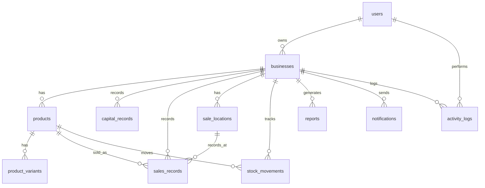

# ERD Manajemen Bisnis

## Relasi utama

- `users` menyimpan profil owner/staff.
- `businesses` adalah tenant bisnis; semua data operasional terkait ke bisnis.
- `products` dan `product_variants` menyimpan master produk, harga modal, harga jual, margin, stok.
- `capital_records` menyimpan pengeluaran/modal dan item pembelian.
- `sale_locations` menyimpan toko/outlet/channel penjualan, PIC, alamat, target omzet, jam operasional, status aktif, dan catatan harga.
- `sales_records` menyimpan transaksi penjualan, omzet, laba, lokasi/toko, dan bukti transaksi.
- `stock_movements` menjadi audit stok masuk/keluar/adjustment.
- `reports`, `notifications`, `activity_logs` untuk pelaporan, reminder, dan audit.
